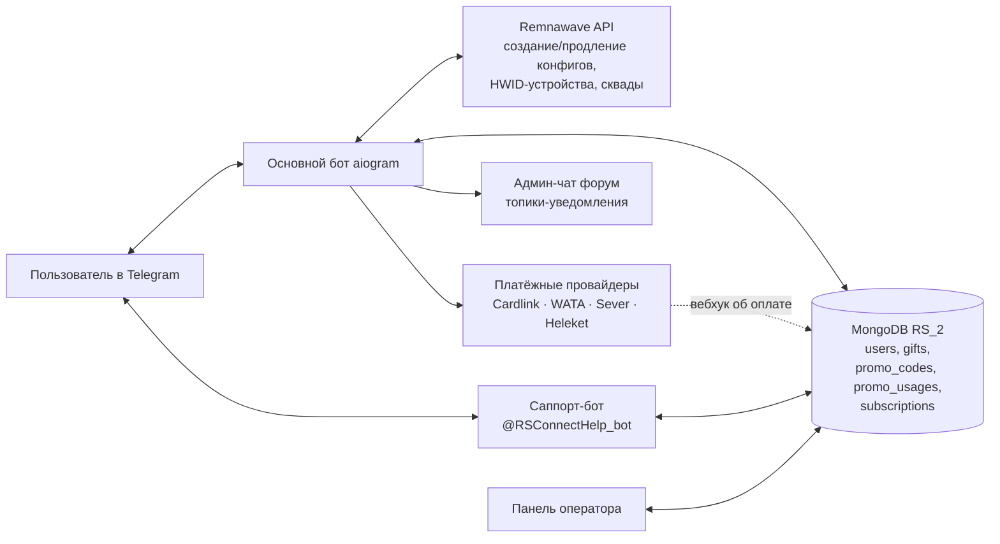
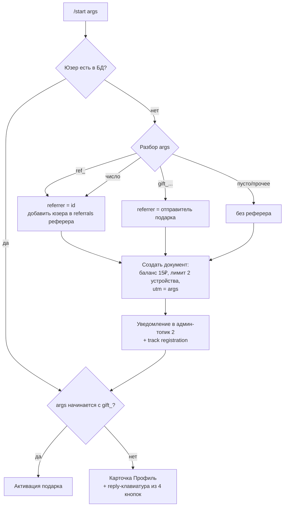
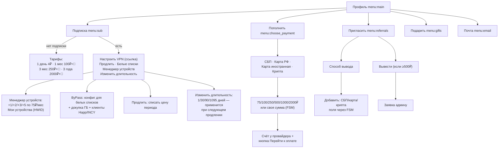
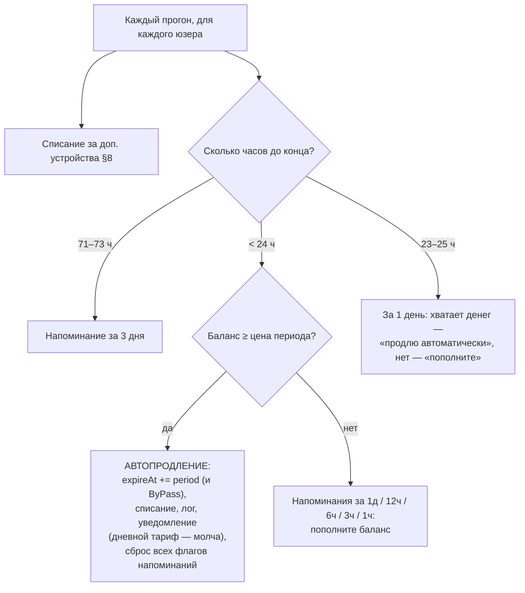
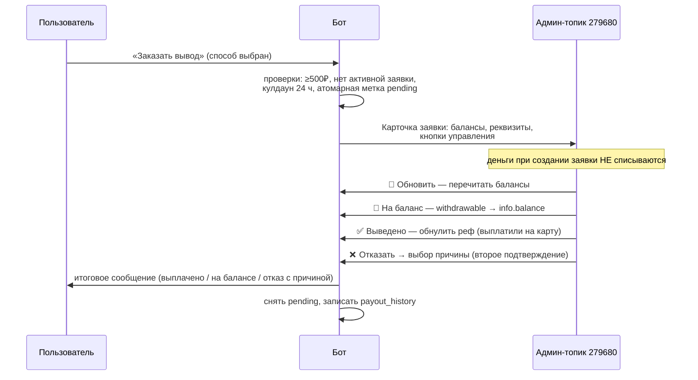
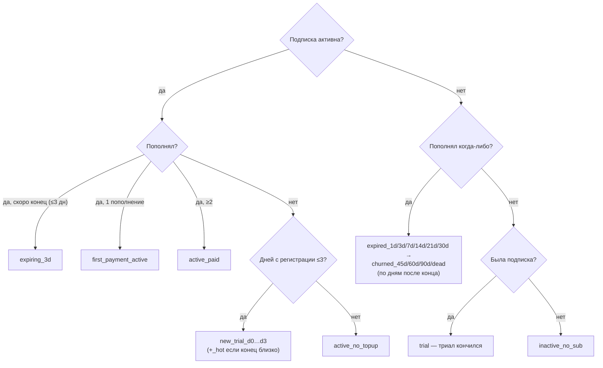
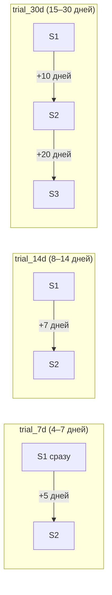
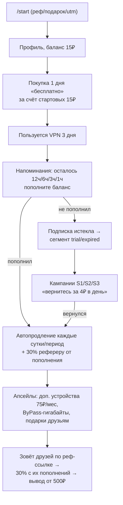

# Основной бот RS VPN (@rsconnect_bot) — как всё работает

Документация по коду основного бота: `handlers/start.py`, `utility/utils.py`,
`handlers/payout_system.py`, `campaigns_trial.py`, `resend_payouts.py`.
Диаграммы — Mermaid, GitHub рендерит их прямо в браузере.

---

## 1. Общая архитектура



Ключевая модель — **внутренний баланс**: пользователь пополняет баланс через
платёжный провайдер, а все покупки (подписка, устройства, гигабайты, подарки)
списываются с баланса. VPN-конфиги живут в Remnawave, бот хранит их слепок в
документе пользователя (`vpn.*`).

Топики админ-чата (`-1002433849803`), куда бот шлёт уведомления:

| Топик | Что приходит |
|---|---|
| 2 | новые регистрации |
| 4 | попытки пополнения (создан счёт) |
| 244 | покупки подписок |
| 24240 | привязанные почты |
| 279680 | заявки на вывод реферальных средств |
| 470234 | отчёты о рассылках-кампаниях |

## 2. Документ пользователя (коллекция `users`)

```
user_data:  user_id, username, first/last_name, date_joined, referrer, utm
info:
  balance                 — внутренний баланс, ₽
  email                   — почта («Не привязана» по умолчанию)
  transactions            — история пополнений (пишет платёжный вебхук)
  logs_balance            — лог движений баланса (add_log_balance)
  gifts: {1day, 1month}   — запас подарочных подписок
  ref_stats:
    withdrawable          — реферальный баланс к выводу
    referrals[]           — кто пришёл по ссылке
    paying_referrals[], payments_count, turnover_total, earned_total
    method[]              — сохранённые способы вывода (СБП/карта/крипта)
    method_draft          — черновик способа (заполняется по полям через FSM)
    payout_selected       — выбранный способ («bot_balance» по умолчанию)
    pending_payout_active — есть необработанная заявка
    last_payout_request_at, payout_history[]
  support: {status, thread_id}  — тикет в саппорт-боте
vpn:
  period (1/30/90/1095), shortUuid, uuid, createdAt, expireAt,
  hwidDeviceLimit (базово 2), extraDevices[], notified{}, preferred_client,
  bypass_uuid, bypass_shortUuid, bypass_expireAt, bypass_trafficLimitBytes,
  bypass_connectUrl, bypass_connectUrl_incy
growth:      — сегментация: segment, ab_group, trial_ab_group, has_topup,
               days_since_expired, topups_count … (пересчитывается фоном)
campaigns:   — метки отправленных кампаний: {segment}_s{N}_sent: дата
logs:        — журнал действий (add_log)
```

## 3. `/start`: регистрация и deep-links



* Новичок получает **15₽ стартового баланса** — их хватает на ~3 дня
  ежедневной подписки по 4₽ (первая покупка подписки показывается как
  «Бесплатно», но технически списывает 4₽ из стартовых).
* `REF_MAP` — именные реферальные алиасы (например `ref_myprofile`),
  замапленные на конкретные user_id.
* `utm` сохраняется как есть — по нему считается источник трафика.

## 4. Карта меню

Всё меню — одно фото-сообщение, которое редактируется
(`edit_message_media`) при навигации. Callback-и имеют вид `menu:*`.



Reply-клавиатура (постоянные кнопки): Профиль, Подключить RS VPN,
Пополнить баланс, О сервисе, RS VPN Web (личный кабинет console.rscore.app).

## 5. Покупка и продление подписки

**Тарифы** (`plan_base_price`): 1 день — 4₽, 30 дней — 100₽, 90 дней — 250₽,
3 года (1095 дней) — 2000₽.

Покупка (`menu:*:buy_sub`):
1. Если баланса не хватает — экран «недостаточно средств» со способами оплаты.
2. Если хватает — `create_vpn_subscription()` создаёт юзера в Remnawave
   (назначаются сквады, см. §12), бот сохраняет `vpn.*`, списывает цену,
   пишет `add_log_balance`, шлёт событие `subscription_created` и
   уведомление в админ-топик 244.
3. Бонусом начисляются подарочные подписки: за 1 месяц — +1 «1 день»,
   за 3 месяца — +1 «1 месяц», за 3 года — +3 «1 месяц».

Продление кнопкой (`menu:extend`) — то же списание, `expireAt += period`
(двигается и ByPass). Смена длительности (`menu:new_type`) меняет только
`vpn.period` — применится при следующем продлении.

## 6. Пополнение баланса и платёжные провайдеры

| Кнопка | callback | Провайдер |
|---|---|---|
| ⚡️ СБП | `sbp_rezerv` | Cardlink |
| (скрыто) СБП | `sbp` | WATA |
| 💳 Карта РФ | `cards_ru` | Sever (раньше CloudPayments) |
| 🌐 Карта иностранная | `cards_eu` | Sever |
| 💸 Криптовалюта | `crypto` | Heleket |

* Минимальная сумма 75₽ (для СБП и иностранных карт — 100₽); если у юзера
  есть подписка, первой кнопкой предлагается его персональная сумма
  (цена тарифа + доп. устройства).
* «✏️ Указать сумму» — FSM `TopUpStates.ENTER_AMOUNT`.
* Бот только **создаёт счёт** и даёт ссылку; зачисление на баланс делает
  вебхук провайдера (вне этих файлов) — он же пишет транзакцию и начисляет
  рефереру 30%.
* На экране пополнения новичкам/триальщикам может показываться бонусная
  строка +15/+30/+50% в зависимости от A/B-группы (см. §13).

## 7. Фоновый цикл подписки: напоминания и автопродление

`process_subscriptions()` запускается планировщиком и проходит по всем, у кого
есть подписка. Флаги в `vpn.notified` защищают от повторных отправок.



Особенности:
* автопродление пытается выполниться **при каждом прогоне**, пока осталось
  меньше суток — как только деньги появились, подписка продлится;
* для ежедневного тарифа (4₽) напоминания шлются только если денег
  **не хватает** — платящих не спамят каждый день;
* уведомление «подписка истекла» в коде закомментировано — возвраты
  истёкших берут на себя кампании (§14).

## 8. Доп. устройства (75₽/мес за штуку)

Базовый лимит — 2 устройства. «Менеджер устройств» продаёт пакеты
+1/+2/+3/+5; каждый пакет — запись в `vpn.extraDevices`:
`{amount, pricePerDevice: 75, nextChargeAt: +30 дней, active}`.

Ежемесячно (внутри `process_subscriptions`):
* наступил `nextChargeAt` и денег хватает → атомарное списание
  `amount × 75₽`, `nextChargeAt += 30 дней`, уведомление юзеру;
* денег не хватает → пакет деактивируется, лимит пересчитывается
  (2 + активные пакеты) и синхронизируется в Remnawave, юзеру
  уведомление «устройства отключены».

«Мои устройства» показывает реальные HWID-привязки из Remnawave по обоим
конфигам (основной + ByPass) с разбивкой «общие / только основная / только
ByPass»; устройство можно отвязать — слот освобождается, лимит не меняется.

## 9. ByPass (белые списки)

* Создаётся бесплатно кнопкой «Белые списки»: отдельный конфиг в Remnawave
  (`bypass_uuid`) со сроком как у основной подписки и лимитом трафика.
* Трафик докупается с баланса: 5 ГБ — 50₽, 15 ГБ — 90₽, 30 ГБ — 170₽,
  максимальный пакет — 500₽.
* Ссылки подключения шифруются под клиент: Happ (`encrypt_url`) или INCY
  (`encrypt_url_incy`, вызывает node-скрипт); выбранный клиент запоминается
  в `vpn.preferred_client`.

## 10. Реферальная программа и вывод средств

Ссылка `t.me/rsconnect_bot?start=ref_<uid>`. Реферер получает **30% от каждого
пополнения** приглашённого (начисляет платёжный вебхук в
`ref_stats.withdrawable`). Меню показывает статистику: рефералы, платящие,
активные, оборот, заработано.

Вывод — от **500₽**. Способы: на баланс бота, СБП, карта МИР, крипта
(USDT TRC-20). Реквизиты заполняются по полям через FSM-черновик
(`method_draft` → «Добавить» → сохранённый способ).



Антиспам: одна активная заявка + одна заявка в 24 часа. Отказ **не трогает**
реф-баланс — юзер может исправить реквизиты и подать заново.
`resend_payouts.py` — разовый скрипт-рассылка «оформите заявку заново» всем
с withdrawable ≥ 500₽ (после смены системы выводов).

## 11. Подарки и промокоды

**Подарки** — через inline-режим: набрать `@rsconnect_bot` в любом чате и
выбрать подписку (1 день 4₽, 7 дней 28₽, 1 месяц 100₽, 3 месяца 250₽,
3 года 2000₽). Получатель жмёт кнопку → deep-link `gift_...` → активация:

* подарок одноразовый (файл `gifts.json` + коллекция `gifts`), свой принять нельзя;
* если у **дарителя** есть запас подарочных подписок (`info.gifts`) — списывается
  оттуда, иначе с его баланса (не хватает — обе стороны получают отказ);
* получателю подписка создаётся или продлевается на срок подарка.

**Промокоды**: любое сообщение в личку, не попавшее в другие обработчики,
сначала проверяется как промокод (`promo_codes`): активность, срок,
лимит использований, одно применение на юзера (`promo_usages` с уникальным
индексом). Награды: `balance` (₽ на баланс) или `traffic_gb` (гигабайты
ByPass). Если это не промокод — стандартный ответ-фолбэк.

**Почта**: сообщение, похожее на e-mail (regex), сохраняется в `info.email`
(нужна для карт-платежей и связи вне Telegram) + уведомление в топик 24240.

## 12. Remnawave: сквады и распределение

При создании конфига юзеру назначаются internal squads:
базовый сквад + один «дополнительный» по round-robin + 5 «fingerprint»-сквадов,
детерминированно выбираемых из 15 по user_id (уникальная комбинация — 3003
варианта). Это размазывает пользователей по серверам и делает наборы
отпечатков разными. При продлении сквады доназначаются, если их не хватает.

## 13. Сегментация пользователей (growth.*)

`update_users_segments()` фоном пересчитывает сегмент каждого юзера:



A/B-группы назначаются один раз и не меняются: `ab_group`
(bonus_30 / bonus_15) для new_trial-сегментов, `trial_ab_group`
(control / bonus_30 / bonus_50) для trial. Группа влияет на бонусную строку
на экране пополнения и (раньше) на тексты кампаний.

## 14. Кампании-рассылки (campaigns_trial)

Цель: вернуть тех, кто попробовал триал и не заплатил (`segment = trial`,
`has_topup = false`). Сегменты по дням с окончания подписки и серии касаний:



* Отправка только с 9:00 до 22:00; каждое касание помечается
  `campaigns.{segment}_s{N}_sent`, серия N+1 уходит только тем, кто получил N
  и выждал задержку.
* `trial_60d` и `trial_dead` **отключены** — конверсия 0.2–1.2%.
* A/B показал: бонусы +30/+50% не улучшают конверсию против контроля,
  поэтому всем шлётся control-текст («4₽ в день»), бонусные ветки оставлены
  в коде выключенными.
* Итог каждой серии — отчёт в админ-топик 470234.
* Флуд-лимиты Telegram обрабатываются (`TelegramRetryAfter` → ждём и
  повторяем), заблокировавшие бота просто пропускаются.

## 15. Аналитика и логи

* `track(event, user_id, props)` — события: `registration`,
  `subscription_created`, `subscription_renewed`, `view_topup`,
  `payment_initiated` (+ события вебхука).
* `add_log(uid, text)` — журнал действий в документе юзера;
  `add_log_balance(uid, amount, details)` — лог движений баланса
  (его показывает и карточка `/check` в саппорт-боте, и панель оператора).

## 16. Что за чем идёт: путь пользователя целиком



---

*Документ составлен по загруженным исходникам (июль 2026). Если в боте
что-то меняется (цены, провайдеры, кампании) — правьте таблицы здесь же.*
